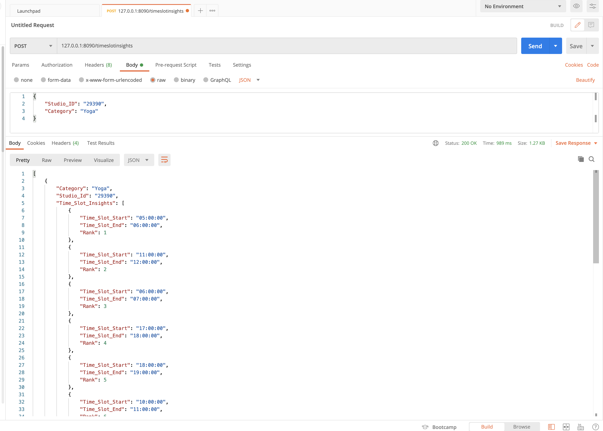

# Smart-Recommender
## Installation
1. Install [python-3.9](https://www.python.org/downloads/release/python-390/).
2. Create a virtual environment in the root directory of the repository
```
pip3 install virtualenv
virtualenv venv
```

3. Enable the virtual environment venv everytime
```
venv\Scripts\activate
```

4. Install package requirements
```
pip3 install -r requirements.txt
```

## Run the API
1. From the root directory run `python3 -m api.py` to host the api.
2. Tested out the working of the API using POSTMAN

 
